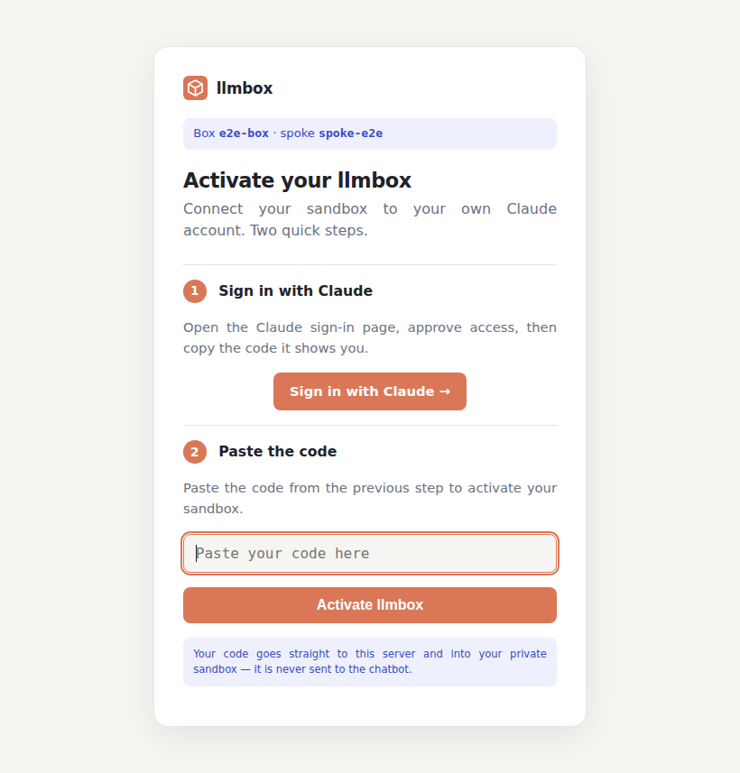
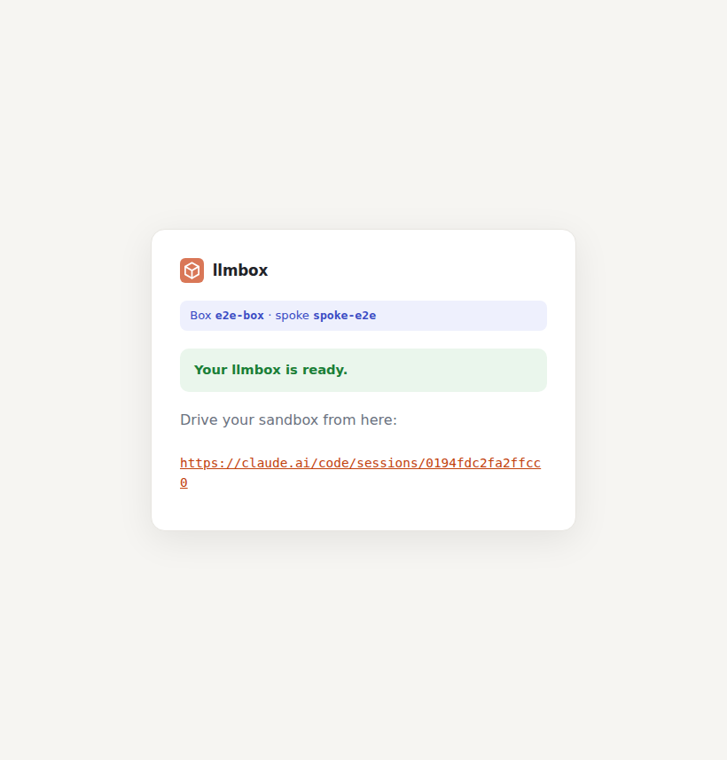
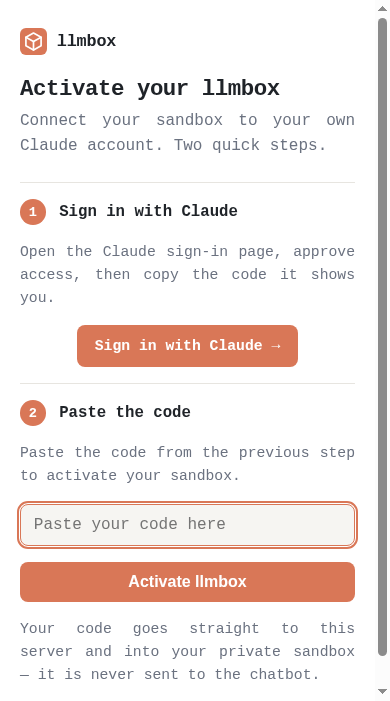

# Architecture

How llmbox is put together and why the auth secret stays out of the chatbot.

## The auth secret never touches the chatbot

The OAuth code exchanges for a full-scope account token, so it must never enter
the model's context. This is split accordingly across two front-ends on two
separate ports:

| Port / path                 | Audience | Carries |
|-----------------------------|----------|---------|
| `mcp_addr` `/api/v1/...`    | the chatbot, via the `llmbox-mcp` binary (which serves MCP and forwards here) | box IDs + the **auth page URL** only |
| `http_addr` `/auth/{token}` | the human, in a browser | the **OAuth code** (browser → this server → container stdin) |

The code travels from the user's browser to the box's `claude auth login`
process; it is never an MCP input or output and is never logged.

## Flow

```
chat: "create an llmbox"
  └─ create_llmbox ──▶ starts a box parked at `claude auth login`,
                       captures its OAuth authorize URL,
                       returns  https://YOUR_HOST/auth/<token>   (+ auth_token)

user opens that URL ──▶ "Sign in with Claude" (their account) ──▶ copies the code
                   ──▶ pastes it into the page ──▶ server feeds it to the box

box finishes login ──▶ `claude remote-control` starts ──▶ session URL
  └─ get_llmbox(box_id) ──▶ returns the session URL once ready
```

Boxes that are never authenticated are destroyed after `auth_ttl`
(default 5 minutes) — see [Orphan cleanup](operations.md#orphan-cleanup).

## The activation page

This is what the user sees at the auth-page URL — paste the code to activate, and
the box reports ready with its session URL. The page is responsive, so on a phone
it drops the card framing and fills the screen. These images are **captured by the
end-to-end test** (headless Chrome via WebDriver) and refreshed by CI **on the
pull request** that changes the UI — committed straight into the PR's diff — so
they always reflect the current UI and stay reviewable; see
[Testing](development.md#testing).

| Activate | Ready | On mobile |
|----------|-------|-----------|
|  |  |  |

## Components

| Path                 | What it is |
|----------------------|------------|
| `cmd/llmbox`         | Entry point: opens the session store, runs the HTTP server (MCP + auth pages) and the reaper. |
| `internal/docker`    | Box lifecycle over the Docker Engine API (create with image auto-pull + box-ID uniqueness, login-capture, code-submit, graceful destroy, reap). |
| `internal/server`    | Session registry (persisted to bbolt), MCP tools, auth web pages, reaper loop. |
| `Dockerfile`         | Image for **this server** (`llmbox`). Carries only the llmbox server binary; it neither runs nor ships Claude. |
| `Dockerfile.box`     | Default box image (`claude_image`). Bakes in the standalone Claude binary, tini (PID 1), util-linux, Node.js + pm2 (so Claude can run daemons), and a CA bundle. |

Boxes run on the box image (`claude_image`, default
`ghcr.io/clems4ever/llmbox-box`, built by `Dockerfile.box`), which **bakes in**
the standalone Claude binary along with `tini`. The server injects only a small
`~/.claude.json` seed into each box at creation, and runs it as root with
`HOME=/root` and a `/workspace` working directory. The entrypoint runs under
`tini` as PID 1, so the many short-lived processes Claude's tools spawn are
reaped instead of accumulating as zombies. The default image also ships Node.js
and `pm2`, so Claude can start, list, and stop long-running daemons at runtime
(`pm2 start <cmd>`). Any glibc image bundling Claude, `tini`, `/bin/sh`,
`util-linux` (for `script`), and CA certificates works.
