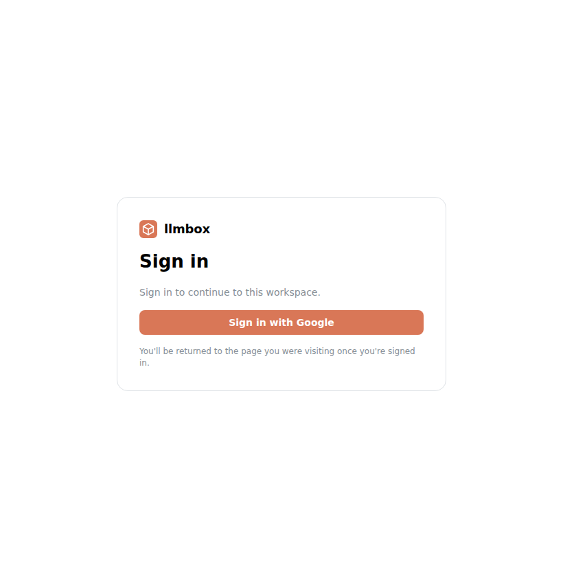
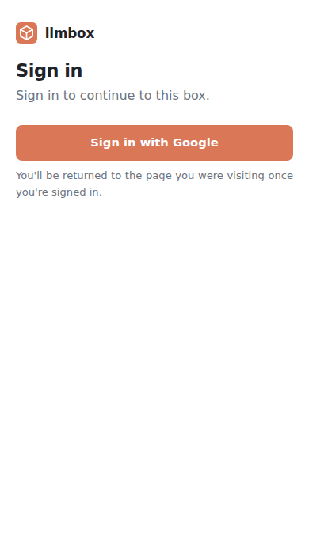

# Proxying box HTTP ports

llmbox can expose an HTTP server running **inside a box** to a human's browser,
so a user can ask Claude to "start a dev server and let me see it" and get back a
working URL. Proxies are **default-deny**: nothing is reachable until the agent
explicitly enables a proxy (over MCP or the admin UI).

## How it works

```
browser ──▶ https://<slug>.proxy.example.com/...
              │  (wildcard DNS + TLS at your reverse proxy)
              ▼
            hub (APIHandler)  ── host is a proxy sub-domain?
              │  authorize the signed-in user
              │  resolve <slug> ─▶ (box, port, spoke)
              ▼
            box dialer ──▶ the box's port on its own Docker network
```

- Each enabled proxy gets an unguessable **slug** and is reached at its own
  **sub-domain** `https://<slug>.<base_domain>/`. Because the box's app is served
  at the sub-domain root, single-page apps and servers that emit absolute paths
  (`/static/app.js`, `fetch('/api')`, client-side routing, WebSockets, SSE) work
  **without any path rewriting**.
- The hub reaches the box over the spoke's box dialer, which connects to the
  box's address on its **own dedicated Docker network** — the box publishes no
  host ports, and the managed-only resolution means a proxy can never be pointed
  at an arbitrary container.
- A proxy is removed automatically when its box is destroyed or reaped.

## Enabling it

Set a base domain in the config:

```yaml
proxy:
  base_domain: "proxy.example.com"
```

and provide, at your TLS-terminating reverse proxy in front of the hub:

- a **wildcard DNS** record `*.proxy.example.com` pointing at the hub, and
- a **wildcard TLS certificate** for `*.proxy.example.com`.

## Authentication

When activation auth is configured, a proxy request must carry a signed-in
session allowed to activate boxes — the same gate as box activation. The login
cookie is host-scoped by default, so to share one sign-in between the main UI and
the per-proxy sub-domains, set the parent domain both share:

```yaml
auth:
  cookie_domain: ".example.com"
```

A signed-out **browser** that opens a proxy URL is redirected to a sign-in page
on the main host, carrying the proxy URL as the return target; once signed in,
the shared cookie lets the same URL through and the user lands back where they
started. (Non-browser requests — XHR, WebSocket, anything that isn't a top-level
navigation — get a plain `401` instead, so a redirect to HTML can't corrupt
them.) The sign-in page is responsive, dropping the card framing to fill a phone
screen. Like the [activation page](architecture.md#the-activation-page), these
images are **captured by the end-to-end test** and refreshed by CI on the pull
request that changes the UI; see [Testing](development.md#testing).

| Sign in | On mobile |
|---------|-----------|
|  |  |

With no auth provider configured, proxying is open (like the rest of the server,
which then relies on a front authenticating proxy) — do not expose it to
untrusted networks in that mode.

## How the box is reached

Every box runs on a spoke, and the hub reaches its port by opening a live **byte
tunnel** to it over the cluster transport (`stream_open`/`stream_data`/`stream_close`
frames): the spoke dials the box with `DialBox` and splices the two together. The
reverse proxy runs over that live connection, so it **streams** — WebSockets, SSE,
and large transfers all work, to a box on any spoke. The same managed-only
resolution applies, so a tunnel can only reach a port inside one of the spoke's
own boxes — never an arbitrary host address.

## Box-initiated port publishing

The Claude running **inside** a box can publish, list, and unpublish its own
box's ports without any credential: every box gets a local control socket at
`/run/llmbox/boxapi.sock` (served from **outside** the sandbox — by the spoke
through the Docker bind mount, or via a per-VM vsock listener on Firecracker),
and a `box-ports` Claude Code skill baked into the box image teaches Claude to
`curl` it (`/v1/open_port`, `/v1/close_port`, `/v1/list_ports`).

The request body carries only a port and description — never a box or spoke
identity. Scoping is enforced twice, both outside the sandbox:

1. the **spoke** stamps the box ID from its own record of which per-box channel
   the request arrived on, so nothing inside a box can address another box;
2. the **hub** takes the spoke name from the authenticated cluster connection
   and verifies that box actually lives on that spoke before touching proxy
   state (the same `create-proxy` path the admin API uses, recorded as
   `box:<box id>`).

The control socket is deliberately a unix socket, not a TCP port: the proxy
data path only dials TCP ports inside the box, so the box can never publish its
own control API. A box created **without a box ID** cannot publish ports
(proxies are keyed by box ID); its calls fail with a clear explanation. When
proxying is disabled hub-wide, opening a port fails with the disabled message,
but closing still works so a box can always clean up after itself.

## Other notes

- The hub never touches a box's network directly: the spoke reaches its own boxes
  and the hub only sees the tunnel over the cluster transport. So a containerized
  hub needs no access to any box's Docker network.
